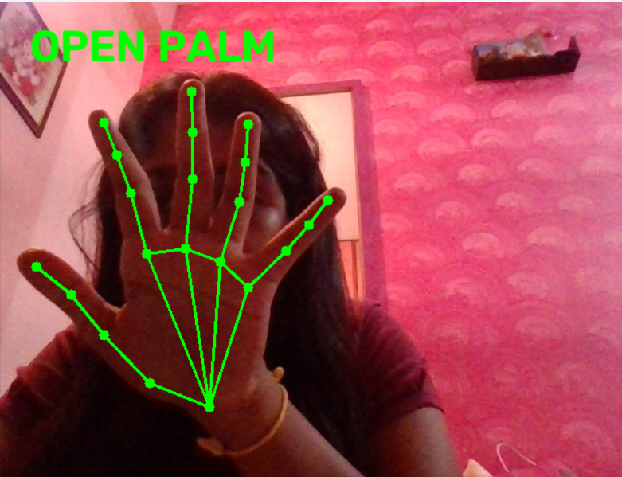
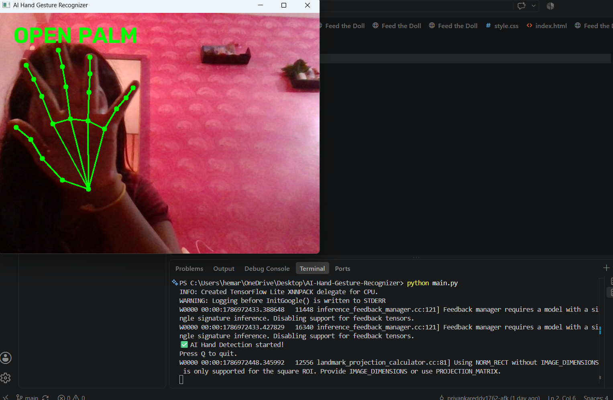

# Hand Gesture Recognizer

A Python-based Hand Gesture Recognition project that uses a webcam to detect and recognize different hand gestures in real time.

## Features

- Real-time hand gesture recognition
- Uses webcam input
- Recognizes Palm, Fist, and Peace gestures
- Displays the detected gesture

## Gestures Recognized

| Gesture | Description |
|---|---|
| 🖐️ Palm | Open hand |
| ✊ Fist | Closed hand |
| ✌️ Peace | Two fingers raised |

## Screenshots

### Palm Gesture

### Fist Gesture

### Peace Gesture

### Output terminal

