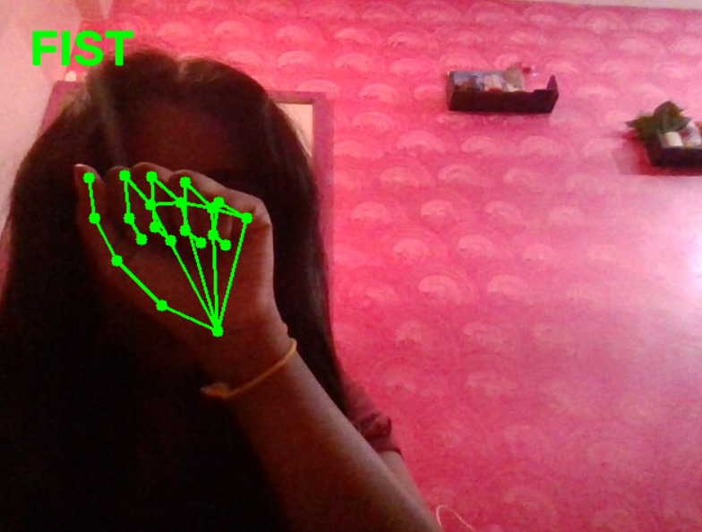
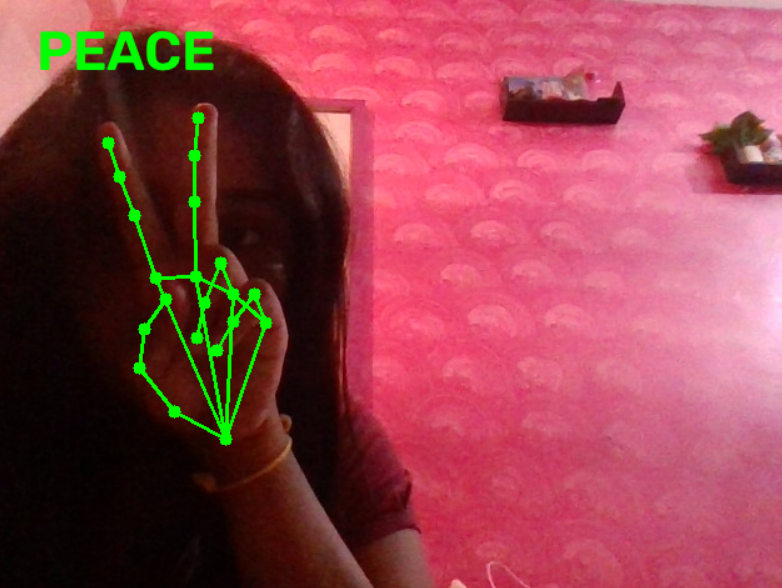

# 🤖 AI Hand Gesture Recognizer

> **Real-time hand gesture recognition using Computer Vision, MediaPipe and Python.**

An interactive computer vision application that detects a user's hand through a webcam, tracks hand landmarks in real time, and recognizes predefined hand gestures.

Built as a collaborative software project to explore **Artificial Intelligence, Computer Vision, real-time image processing, and Python application development**.

---

## 📌 Project Overview

Human-computer interaction is increasingly moving beyond traditional keyboards and mice.

This project demonstrates a practical approach to **touch-free interaction** by using a webcam to detect hand movements and recognize predefined gestures in real time.

The system captures live video frames, processes them using OpenCV, detects hand landmarks using MediaPipe, and applies gesture-recognition logic to determine the gesture being performed.

### 🎯 Objective

To build a lightweight, real-time hand gesture recognition system that can:

- Detect a human hand using a webcam
- Track hand landmarks
- Analyze landmark positions
- Recognize predefined gestures
- Display the recognized gesture in real time
- Run locally without requiring a remote server

---

# ✨ Key Features

- 🎥 **Real-Time Webcam Processing**
- ✋ **Hand Detection**
- 📍 **21-Point Hand Landmark Tracking**
- 🧠 **Gesture Recognition**
- ⚡ **Real-Time Prediction**
- 🖥️ **Local Processing**
- 🔒 **No Remote Video Upload**
- 🐍 **Python-Based Implementation**
- 🔧 **Modular Project Structure**
- 🤝 **GitHub-Based Team Collaboration**

---

# 📸 Project Screenshots

## ✋ Open Palm

The system detects the hand and identifies an open-palm gesture in real time.

---

## ✊ Fist

The system recognizes a closed-fist gesture using the detected hand landmarks.

---

## ✌️ Peace Gesture

The system identifies the peace gesture from the relative positions of the fingers.

---

# 🧠 How It Works

The application follows a real-time computer vision pipeline:

             📷 WEBCAM
                 │
                 ▼
        ┌─────────────────┐
        │     OpenCV      │
        │ Frame Capture   │
        └────────┬────────┘
                 │
                 ▼
        ┌─────────────────┐
        │    MediaPipe    │
        │  Hand Detection │
        └────────┬────────┘
                 │
                 ▼
        ┌─────────────────┐
        │ Hand Landmarks  │
        │   21 Points     │
        └────────┬────────┘
                 │
                 ▼
        ┌─────────────────┐
        │    Gesture      │
        │   Recognition   │
        └────────┬────────┘
                 │
                 ▼
        ┌─────────────────┐
        │ Real-Time Result│
        │  on Video Feed  │
        └─────────────────┘

Processing Pipeline
1. Capture
OpenCV captures frames from the system webcam.
2. Frame Processing
The captured frame is prepared for hand landmark detection.
3. Hand Detection
MediaPipe detects the presence of a hand in the frame.
4. Landmark Detection
The system identifies 21 key landmarks representing important points of the hand.
5. Gesture Analysis
The landmark positions are analyzed using gesture-recognition logic.
6. Result Display
The detected gesture is displayed directly on the live camera feed.
🛠️ Technology Stack
Technology	Purpose
Python 3.11	Core application development
OpenCV	Webcam access and image processing
MediaPipe	Hand detection and landmark tracking
NumPy	Numerical operations
Git	Version control
GitHub	Source control and collaboration
VS Code	Development environment

🏗️ Project Architecture

AI-Hand-Gesture-Recognizer/
│
├── models/
│   └── hand_landmarker.task
│
├── screenshots/
│   ├── open-palm.png
│   ├── fist.png
│   └── peace.png
│
├── main.py
├── gesture_recognition.py
├── requirements.txt
├── README.md
└── .gitignore

Core Components

main.py
Responsible for:

Starting the webcam
Capturing video frames
Running the hand-detection pipeline
Displaying the real-time result

gesture_recognition.py
Contains the gesture-recognition logic used to interpret detected hand landmarks.

models/
Contains the MediaPipe hand landmark model required by the application.

requirements.txt
Defines the Python dependencies required to reproduce the project environment.

🚀 Getting Started

Prerequisites

Make sure you have:
Python 3.11
Git
A working webcam
macOS, Windows, or Linux environment compatible with the required dependencies

1. Clone the Repository
git clone https://github.com/harshithreddy05/AI-Hand-Gesture-Recognizer.git
Move into the project directory:
cd AI-Hand-Gesture-Recognizer

2. Create a Virtual Environment

macOS / Linux
python3.11 -m venv .venv
Activate it:
source .venv/bin/activate

Windows
py -3.11 -m venv .venv
Activate it:
.venv\Scripts\activate

3. Install Dependencies

pip install -r requirements.txt
The project uses a pinned MediaPipe version to maintain compatibility with the current implementation.

4. Run the Application

python main.py
The webcam window should open and begin processing the live video feed.
Perform a supported gesture in front of the camera to see the recognition result.

Exit
Press:
Q
to close the application.

💻 Running on Another Computer

The project is designed to run independently on another compatible computer.
The other user does not need access to the developer's computer or local network.

They only need to:

Clone Repository
       ↓
Install Python 3.11
       ↓
Create Virtual Environment
       ↓
Install requirements.txt
       ↓
Run main.py
       ↓
Use Their Own Webcam

The application performs the recognition locally.

🔐 Privacy

The application processes the webcam stream locally on the user's computer.
No webcam footage is intentionally uploaded to a remote server by the application.
Camera access depends on the operating system's permission settings.

🤝 Collaboration
This project was developed collaboratively using Git and GitHub.

Development Workflow

Developer
    │
    ▼
Local Development
    │
    ▼
Git Commit
    │
    ▼
GitHub Repository
    │
    ▼
Collaborative Development
    │
    ▼
Testing & Improvements

GitHub was used for:

Source-code management
Version control
Collaboration
Change tracking
Project documentation

🧪 Testing

The application was tested for:

Webcam initialization
Hand detection
Hand landmark tracking
Gesture recognition
Real-time video processing
Dependency compatibility
Running the project in an isolated Python environment

📊 Current Capabilities

| Capability               | Status |
| ------------------------ | ------ |
| Webcam Input             | ✅      |
| Real-Time Hand Detection | ✅      |
| Hand Landmark Tracking   | ✅      |
| Gesture Recognition      | ✅      |
| Local Processing         | ✅      |
| Cross-Environment Setup  | ✅      |
| GitHub Collaboration     | ✅      |

🔮 Future Improvements

The project can be extended with:
🎯 Improved gesture classification
🤚 Two-hand gesture recognition
➕ Additional gestures
📊 Gesture statistics and history
🔊 Voice feedback
🖱️ Gesture-controlled mouse
🎵 Gesture-controlled media controls
🎮 Gesture-based gaming controls
🖥️ Graphical user interface
🤖 Machine-learning-based gesture classification
🌐 Web-based interface

💡 Potential Applications

Hand gesture recognition can be applied to:

Human-Computer Interaction
Create touch-free interfaces for computers and smart devices.

Accessibility
Provide alternative interaction methods for users who may have difficulty using traditional input 
devices.

Smart Devices
Use gestures as an interaction mechanism for smart systems.

Gaming
Use hand gestures as an additional input method for interactive applications.

Education
Demonstrate practical applications of computer vision and artificial intelligence.

🎓 Learning Outcomes
Through this project, we gained practical experience in:

Python application development
Computer vision
Real-time video processing
OpenCV
MediaPipe
Hand landmark detection
Gesture-recognition logic
Virtual environments
Dependency management
Git and GitHub
Collaborative software development
Debugging cross-platform dependency issues

📈 Future Vision
The long-term goal is to evolve this prototype into a more intelligent gesture-based human-computer interaction system capable of recognizing a larger vocabulary of gestures and using them to control real-world applications.

⭐ Project
If you find this project interesting, consider giving the repository a ⭐.

AI Hand Gesture Recognizer
Built with Python • OpenCV • MediaPipe • GitHub